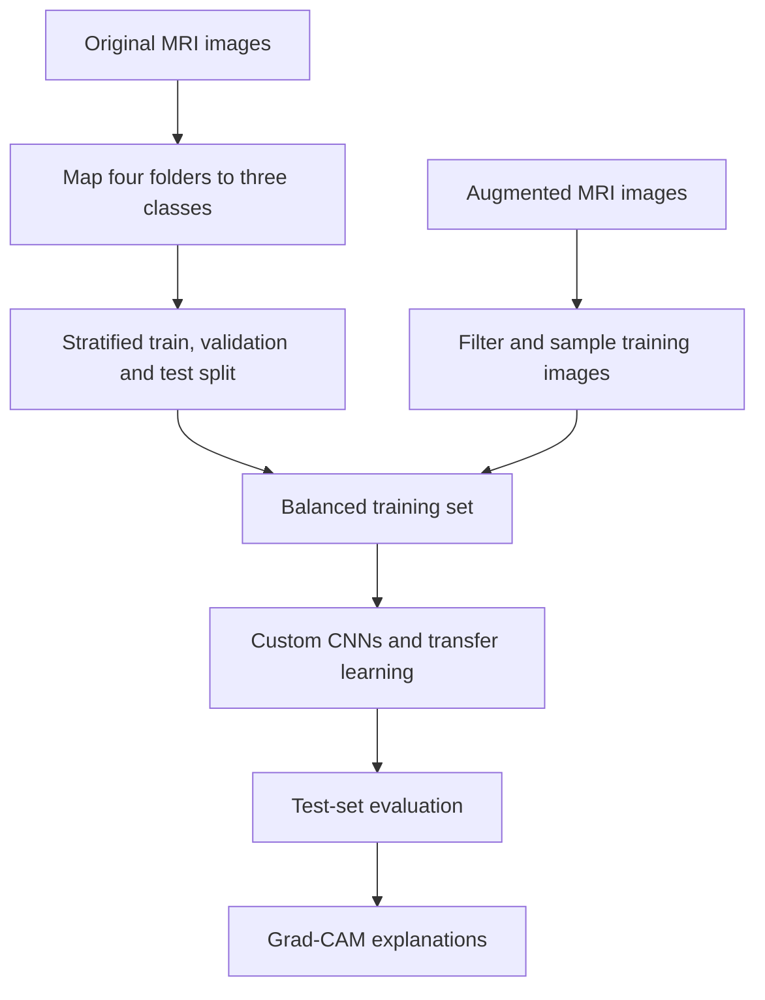

# Early Alzheimer’s Disease Classification from Brain MRI

[](https://www.python.org/)
[](https://pytorch.org/)
[](https://www.kaggle.com/)
[](https://github.com/jacobgil/pytorch-grad-cam)

An experimental deep-learning pipeline for classifying brain MRI images into **Normal**, **Mild Cognitive Impairment (MCI)** and **Alzheimer’s disease** categories. The project compares two custom convolutional neural networks with transfer-learning models and uses Grad-CAM to visualise image regions associated with EfficientNet-B0 predictions.

> **Research-use disclaimer:** This is an educational computer-vision experiment, not a medical device or diagnostic system. Its outputs must not be used to make clinical decisions.

## Project objective

The project investigates whether convolutional neural networks and pretrained image models can distinguish three cognitive-status categories from structural brain MRI images.

The source dataset contains four folders that are mapped into three final classes:

| Original folder | Final class | Numeric label |
|---|---|---:|
| `NonDemented` | Normal | 0 |
| `VeryMildDemented` | MCI | 1 |
| `MildDemented` | Alzheimer | 2 |
| `ModerateDemented` | Alzheimer | 2 |

Combining mild and moderate dementia creates a single Alzheimer class for this experiment. This simplification should be considered when interpreting the results.

## Dataset

The Kaggle input contains an original and an augmented MRI dataset.

### Original images

| Class | Images |
|---|---:|
| Normal | 3,200 |
| MCI | 2,240 |
| Alzheimer | 960 |
| **Total** | **6,400** |

### Augmented images

| Class | Images |
|---|---:|
| Normal | 9,600 |
| MCI | 8,960 |
| Alzheimer | 15,424 |
| **Total** | **33,984** |

The original images are stratified into:

- **Training:** 4,480 images
- **Validation:** 960 images
- **Test:** 960 images

Controlled augmented samples are then added to the training set to obtain **4,000 images per class**, producing a final balanced training set of **12,000 images**. Validation and test sets use original images only.

## Workflow



The implementation covers:

1. Dataset discovery and class remapping
2. Class-distribution analysis and MRI visualisation
3. Stratified train, validation and test splitting
4. Controlled augmentation for class balancing
5. Filename and path overlap checks
6. Grayscale and RGB preprocessing at \(224 \times 224\)
7. Data loading with custom PyTorch datasets
8. Training and checkpointing by validation accuracy
9. Test evaluation with accuracy, macro F1 and per-class metrics
10. Confusion-matrix and learning-curve visualisation
11. Grad-CAM explanations for EfficientNet-B0

## Models

### Baseline CNN 1

A four-block grayscale CNN:

- Convolution, batch normalisation, ReLU and max-pooling blocks
- Channels increasing from 16 to 128
- 128-unit fully connected layer
- Dropout of 0.5
- Three-class output

### Baseline CNN 2

A deeper five-block grayscale CNN:

- Channels increasing from 16 to 256
- Fully connected layers with 256 and 128 units
- Dropout of 0.5 and 0.3
- Three-class output

### ResNet18

An ImageNet-pretrained ResNet18 adapted for three-class MRI classification. Grayscale images are converted to three channels before training.

### EfficientNet-B0

An ImageNet-pretrained EfficientNet-B0 with its classifier replaced for three output classes. Grad-CAM is applied to its final convolutional block.

## Saved-run results

| Model | Test accuracy | Macro F1 |
|---|---:|---:|
| Baseline CNN 1 | 0.8531 | 0.8572 |
| Baseline CNN 2 | 0.9594 | 0.9658 |
| ResNet18 | 0.9969 | 0.9975 |
| EfficientNet-B0 | **0.9979** | **0.9983** |

The saved run reports EfficientNet-B0 as the strongest model, followed closely by ResNet18. The deeper custom CNN also improves substantially over the first baseline.

### Baseline CNN 1 test report

| Class | Precision | Recall | F1 | Support |
|---|---:|---:|---:|---:|
| Normal | 0.95 | 0.80 | 0.87 | 480 |
| MCI | 0.75 | 0.90 | 0.82 | 336 |
| Alzheimer | 0.85 | 0.91 | 0.88 | 144 |

### Baseline CNN 2 test report

| Class | Precision | Recall | F1 | Support |
|---|---:|---:|---:|---:|
| Normal | 0.97 | 0.95 | 0.96 | 480 |
| MCI | 0.93 | 0.96 | 0.94 | 336 |
| Alzheimer | 0.99 | 0.99 | 0.99 | 144 |

## Data-split verification warning

The notebook performs several overlap checks. Its saved outputs report:

- 120 shared base names between training and validation
- 110 shared base names between training and test
- Zero class-aware key matches
- Zero exact file-path matches
- No reduction in augmented images during the cleaning stage

These checks are not fully consistent. Exact path separation alone does not prove that augmented derivatives of the same source image are isolated across splits. The near-perfect transfer-learning results therefore require independent verification using a stricter source-image—or preferably patient-level—grouped split.

Until that verification is completed, the 99%+ results should be treated as **notebook-reported experimental scores**, not evidence of clinical generalisation.

## Explainability with Grad-CAM

Grad-CAM is used with EfficientNet-B0 to produce heatmaps for selected test images from each class. The visualisations provide a qualitative view of the regions influencing a prediction.

Grad-CAM does not prove that the model has learned medically valid biomarkers. A proper explainability evaluation would require:

- Review by qualified clinical experts
- Comparison with anatomical regions of interest
- Stability testing under small image perturbations
- Faithfulness measurements
- Analysis of shortcuts, borders, text markers and acquisition artefacts

## Technology

- Python
- PyTorch and Torchvision
- NumPy and Pandas
- Scikit-learn
- Pillow and OpenCV
- Matplotlib and Seaborn
- `pytorch-grad-cam`
- Kaggle GPU environment

## Repository contents

```text
.
├── README.md
└── alzheimer-disease-early-detection.ipynb
```

## Running the notebook

1. Open the notebook in Kaggle.
2. Attach the Alzheimer MRI dataset containing:

```text
OriginalDataset/
AugmentedAlzheimerDataset/
```

3. Update `original_root` and `augmented_root` if your Kaggle input path differs.
4. Enable a GPU accelerator.
5. Run the cells in order.
6. Install the Grad-CAM package when prompted.

The notebook trains four models and can take considerable time depending on the selected accelerator.

## Limitations

- The dataset does not provide a documented patient-level grouping key in the notebook.
- Possible overlap between source images and augmented derivatives must be resolved.
- Class balancing changes the natural class distribution.
- Mild and moderate dementia are merged into one Alzheimer category.
- Evaluation uses one train–validation–test split rather than cross-validation or external validation.
- MRI acquisition source, scanner variation and demographic coverage are not analysed.
- Near-perfect internal test performance may not transfer to unseen hospitals or populations.
- Grad-CAM is used qualitatively and has not been clinically validated.

## Recommended next steps

1. Rebuild the split before augmentation using immutable source-image or patient identifiers.
2. Generate augmented images only from the training partition.
3. Re-run all models on the corrected split.
4. Add an untouched external dataset for generalisation testing.
5. Report confidence intervals, calibration and class-specific sensitivity and specificity.
6. Compare against a simple clinical baseline.
7. Perform model and data-card documentation.
8. Ask a domain expert to assess Grad-CAM plausibility.

## Responsible use

Medical AI can create serious harm when dataset bias, leakage or uncertainty is hidden behind a high accuracy score. This repository therefore reports the experiment transparently, identifies validation weaknesses and treats explainability as a supporting analysis rather than clinical evidence.
